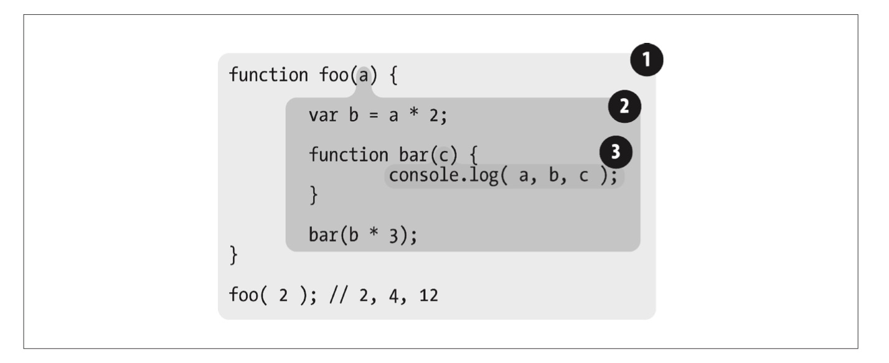

## JavaScript 作用域

### 作用域是什么？

##### 负责收集并维护由所有声明的标识符(变量)，并实施一套非常严格的规则，确定当前执行的代码对这些标识符的访问权限。

换句话说，就是 [js引擎](src) 执行到当前这个{...}代码区域，可以声明或访问到的标示符（变量）。

下面给个例子：

    ❶  包含着整个全局作用域，其中只有一个标识符:foo。
    ❷  包含着 foo 所创建的作用域，其中有三个标识符:a、bar 和 b。   
    ❸  包含着 bar 所创建的作用域，其中只有一个标识符:c。  
